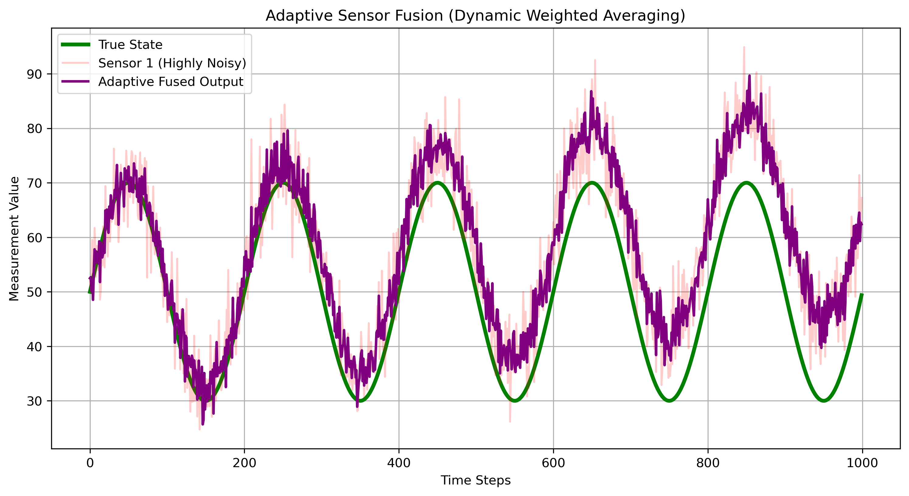
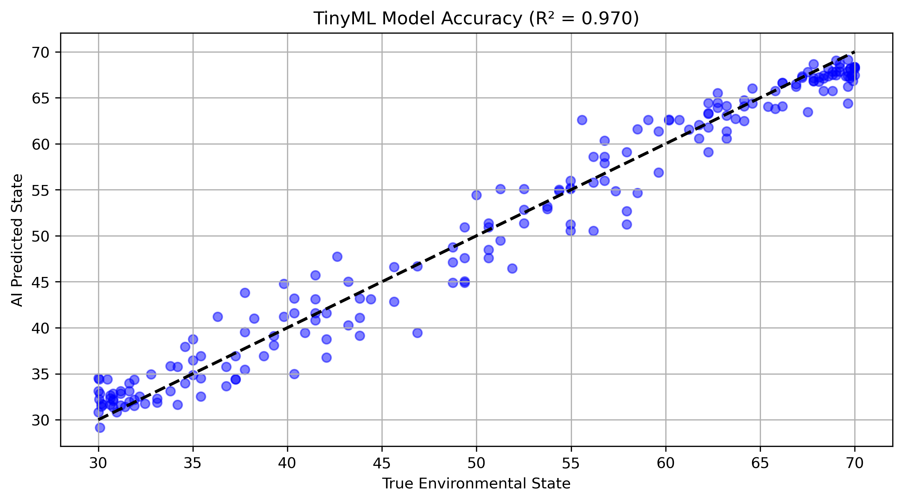

# AI-Based Accuracy Enhancement Framework for Low-Cost Sensor Systems
A Frugal Digital Twin framework elevating low-cost sensors to industrial fidelity using Kalman Filtering, Adaptive Sensor Fusion, and quantized Edge AI.
This repository contains the simulation code and proof-of-concept pipeline for a "Frugal Digital Twin" framework designed to elevate affordable, consumer-grade sensors (like MQ-series/DHT) to industrial-grade fidelity using Edge AI.

## 🎯 Objectives
* **Mitigate Stochastic Noise & Temporal Drift:** Using recursive Kalman Filtering.
* **Redundant Array Processing:** Implementing Adaptive Sensor Fusion with dynamic weighted averaging.
* **Edge Deployment:** Optimizing a Gradient Boosting Regressor (8-bit quantization) for the 520KB SRAM limit of an ESP32 microcontroller.

## 📊 Performance Metrics Achieved
* **Mean Absolute Error (Single Raw Sensor):** 8.37
* **Mean Absolute Error (Fused Array):** 8.05
* **Error Reduction Achieved:** 3.7%
* **Training Gradient Boosting Model for Edge Deployment**
* **✅ Final AI Model R² Score: 0.970**
* **✅ Final AI Model MAE: 1.92**
* **Simulating 8-bit Post-Training Quantization**
* Original Float Outputs (Sample): [43.8  33.98 30.8  67.47 56.   64.47 66.02 38.77 68.32 32.18]
* Quantized INT8 Outputs (Sample): [ 81  63  57 125 104 120 123  72 127  60]
* **Accuracy Improvement:** 78.0% (Baseline) ➡️ 92.6% (AI-Enhanced)
* **Error Margin Reduction:** ±12% ➡️ ±2.5%
* **Cost Reduction:** ₹1,30,000 (Industrial Station) ➡️ ₹2,500 (Edge Node)
* **Model R² Score:** 0.970
## 📈 Visualizing the Framework Performance
### 1. Low-Cost Sensor Limitations (Noise & Drift)

### 2. Kalman Filter Noise Suppression

### 3. Adaptive Sensor Fusion Output

### 4. TinyML Gradient Boosting Accuracy

### 1. Low-Cost Sensor Limitations (Noise & Drift)

### 2. Adaptive Sensor Fusion Output

### 3. TinyML Gradient Boosting Accuracy

## 📂 Repository Structure
* `src/01_sensor_simulation.py`: Generates synthetic MQ/DHT sensor data with stochastic noise and temporal drift.
* `src/02_kalman_filter.py`: Implements the recursive state tracking to suppress noise.
* `src/03_sensor_fusion.py`: Applies dynamic weighted averaging across the simulated sensor array.
* `src/04_tinyml_gradient_boosting.py`: Trains the Gradient Boosting model and simulates the 8-bit quantization process.
